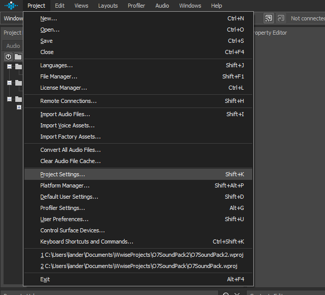
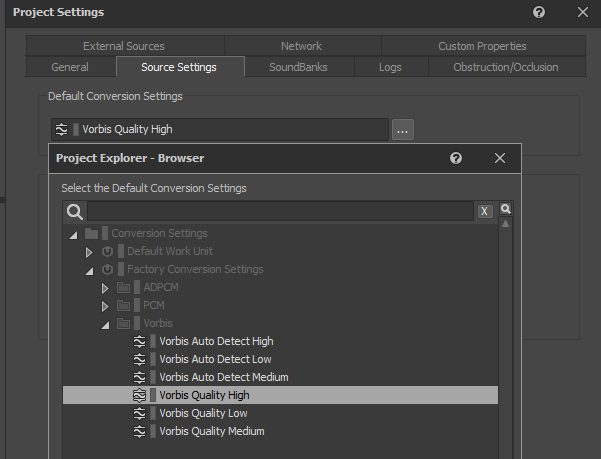
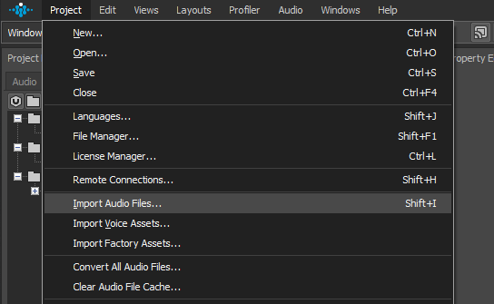
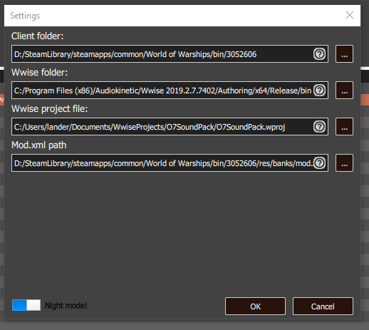
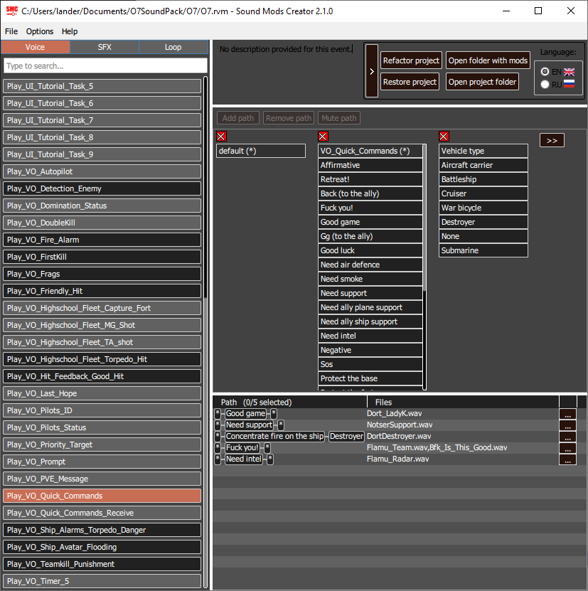
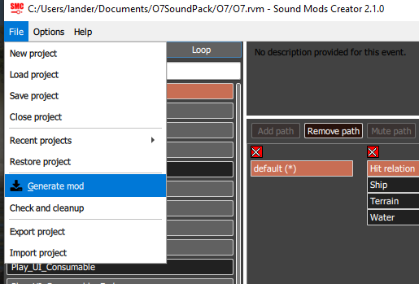
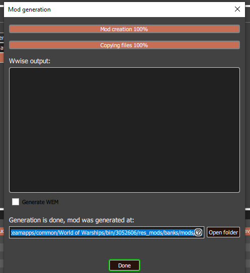
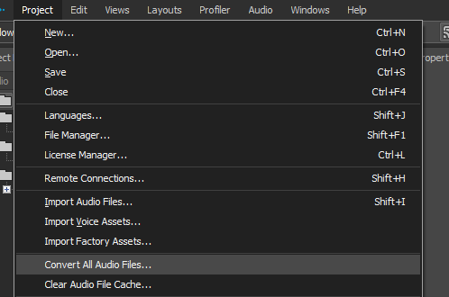

# Background

Comprehensive guides on how sound mods work can be found on the WoWs forum [here](https://forum.worldofwarships.com/topic/142415-tutorial-0831-sound-mod-101-now-with-bonus-tool/). In summary, the mods consist of three pieces:

1. Your mod being present in the `Word of Warships\bin\<GAME_VERSION>\res_mods\banks\mods` directory for **each** version of the game you want the mod to apply to (when there's a patch you'll have to move the mod to the newest directory).
2. A `mod.xml` file that contains metadata about which sound events, and optionally their event *state*, belong to which audio file.
3. The audio files themselves. These are in a proprietary `.wem` format by a company called Audio Kinetic. The `.wem` format appears to be a `.wav` container with custom-encoded sound data. Most (if any) audio processing tools do not understand this file encoding.

## XML Structure

**Note**: You don't need to fully understand the XML structure to make mods. It's just provided here as background info.

Here's an example of what your `mod.xml` looks like (taken from the forum link above):

```xml
<?xml version="1.0"?>
<AudioModification.xml>
    <AudioModification>
        <Name>EN</Name>
        <ExternalEvent>
            <Name>Play_GoodHit</Name>
            <Container>
                <Name>Voice</Name>
                <ExternalId>VGoodHit</ExternalId>
                <Path>
                    <StateList/>
                    <FilesList>
                        <File>
                            <Name>En_Speech_Hit_Confirmation_1.wem</Name>
                        </File>
                        <File>
                            <Name>En_Speech_Hit_Confirmation_2.wem</Name>
                        </File>
                        <File>
                            <Name>En_Speech_Hit_Confirmation_3.wem</Name>
                        </File>
                        <File>
                            <Name>En_Speech_Hit_Confirmation_4.wem</Name>
                        </File>
                        <File>
                            <Name>En_Speech_Hit_Confirmation_5.wem</Name>
                        </File>
                    </FilesList>
                </Path>
            </Container>
        </ExternalEvent>
        <ExternalEvent>
            <Name>Play_Last_Hope</Name>
            <Container>
                <Name>Voice</Name>
                <ExternalId>VLast_Hope</ExternalId>
                <Path>
                    <StateList/>
                    <FilesList>
                        <File>
                            <Name>En_Speech_Last_Hope_1.wem</Name>
                        </File>
                        <File>
                            <Name>En_Speech_Last_Hope_2.wem</Name>
                        </File>
                    </FilesList>
                </Path>
            </Container>
        </ExternalEvent>
    </AudioModification>
</AudioModification.xml>
```

Let's note a few parts:

```xml
<?xml version="1.0"?>
<AudioModification.xml>
    <AudioModification>
        <Name>EN</Name> <!-- Name of the mod -->
```

The `AudioModification\Name` node is the name of the mod as it appears in the game.

```xml
<ExternalEvent>
<Name>Play_GoodHit</Name>
<Container>
    <Name>Voice</Name>
    <ExternalId>VGoodHit</ExternalId>
```

The `AudioModification` node contains many `ExternalEvent` nodes. These are events identified by the `Name` node which may be triggered by the game. In this example, `Play_GoodHit` and `Container\ExternalId` are identifiers the game uses when triggering a sound event. These I believe must match expected values from the game.

```xml
<Path>
    <StateList/>
    <FilesList>
        <File>
            <Name>En_Speech_Hit_Confirmation_1.wem</Name>
        </File>
        <File>
            <Name>En_Speech_Hit_Confirmation_2.wem</Name>
        </File>
        <File>
            <Name>En_Speech_Hit_Confirmation_3.wem</Name>
        </File>
        <File>
            <Name>En_Speech_Hit_Confirmation_4.wem</Name>
        </File>
        <File>
            <Name>En_Speech_Hit_Confirmation_5.wem</Name>
        </File>
    </FilesList>
</Path>
```

Finally, we have the `Path` node. This contains a list of state modifiers (`StateList` -- more on this later) and an array of file names for files which *can* be played for this event. These are relative file paths and can even be in folders outside of the mod directory.

So what about the `StateList`? Well, some events have modifiers that can be applied to further filter the event depending on things like ship type for instance. To use an example from the O7 mod pack:

```xml
<ExternalEvent>
    <Name>Play_VO_Quick_Commands</Name>
    <Container>
        <Name>Voice</Name>
        <ExternalId>VVO_Quick_Commands</ExternalId>
        <Path>
            <StateList>
                <State>
                    <Name>VO_Quick_Commands</Name>
                    <Value>CMD_QUICK_GOOD_GAME</Value>
                </State>
            </StateList>
            <FilesList>
                <File>
                    <Name>Dort_LadyK.wem</Name>
                </File>
            </FilesList>
        </Path>
        <Path>
            <StateList>
                <State>
                    <Name>VO_Quick_Commands</Name>
                    <Value>CMD_QUICK_NEED_SUPPORT</Value>
                </State>
            </StateList>
            <FilesList>
                <File>
                    <Name>NotserSupport.wem</Name>
                </File>
            </FilesList>
        </Path>
```

The game has a single `Play_VO_Quick_Commands` global event when a quick command is played. You can then further filter quick commands by applying (many) state modifiers. To capture the "I need support" quick command for instance, we use:

```xml
<StateList>
    <State>
        <Name>VO_Quick_Commands</Name>
        <Value>CMD_QUICK_NEED_SUPPORT</Value>
    </State>
</StateList>
```

WarGaming provides a `mod.xml` file in the `<GAME_VERSION>\res\banks` directory that outlines the full relationship been events and their states.

# Using Tools

The only tool that is actually required to make sound mods is [Wwise](https://www.audiokinetic.com/courses/wwise101/?source=wwise101&id=installing_wwise). This is required to convert the `.wav` files to `.wem`. Yes, you need to create an account in order to use the tool. No, you do not need to pay for a commercial license.

## Setting up Wwise

After installing Wwise run the Wwise Launcher, then launch Wwise. You'll want to create a new project and name it whatever you'd like. After the project is created, go to `File > Project Settings`:



Click on the `Source Settings` tab, click the button next to `Default Conversion Settings`, and select `Vorbis Quality High`:



You can click "Ok" and get out of this menu now.

Next, you'll want to import your sounds. To do this, click on `File > Import Audio Files`:

.

From this menu you can click on `Add Files` to add individual files or `Add Folder` (recommend just adding the folder) to add a directory full of audio files. Click `Ok` through the following dialogs if there are any.

## Using ffmpeg to extract audio from videos

To extract audio from videos I use `ffmpeg` like so:

```powershell
.\ffmpeg.exe -i '..\..\Bfk_Is_This_Good.mp4' -vn '..\..\O7 Sound pack\QuickCommands\Bfk_Is_This_Good.mp3'
```

This will extract the audio channel from the input video and write it to a `.mp3` file.

## Sound Mod Creator

As mentioned above, you do not need to understand the XML format in order to make mods. I recommend using [Sound Mod Creator](https://forum.worldofwarships.asia/topic/39854-sound-mod-creator-21-create-sound-mods/) and reading that forum post on how to set it up.

After downloading the tool, click on `Project Settings` on top and ensure that your paths look something like this:



1. The first path is to the latest game version directory. You'll have to update this when a new game update is pushed out.
2. The second path is your Wwise `bin` directory. With default installation settings it should be the same as mine.
3. Wwise project file (this is the project you created above)
4. `mod.xml` file is in `World of Warships\bin\<GAME_VERSION>\res\banks\mod.xml` and is necessary for the tool to understand which events the game exposes and which states those events can have. This file *may* change with each release and will need to be updated as the game udpates.

After the project settings are complete, you can go to `File > Import Mod` to import the O7 mod. Select the `SoundModCreator\O7.rve` file and you should be good to go to edit the mod!

### Modifying Events

Events in the Sound Mod Creator look like this:



Here's what's going on:

1. On the left is the currently selected "Global Event". Do not fully trust these names. This `mod.xml` file can be misleading at times. For example, `Play_VO_Ship_Avatar_Flooding` isn't just limited to flooding! It is also supposedly used when your ship receives heavy damage from artillery. In this case we've selected `Play_VO_Quick_Commands`.
2. In the lower middle panel are all of the different events and their corresponding sound files. You can click the button on the far right of each row to add/delete files for this event.
3. In the top panel with the 3 columns are the events we can filter on. You can add more events to filter on by clicking the `>>` button and remove events by clicking the red `X` button above each column.

In this scenario we have 3 states we've decided to filter on:

1. The "default" state (we're handling the `Play_VO_Quick_Commands` event)
2. The `VO_Quick_Command` itself (note the top row of the center column in the top panel)
3. The `Vehicle Type`

This is represented in the `Path` column in the bottom panel. In this case we handle `Good Game`, `Need Support`, `Fuck you!`, and `Need Intel` with no vehicle type filter (any vehicle type). We also handle `Concentrate fire on the ship` with a vehicle type state of `Destroyer` applied so that this custom sound is only played when "Concentrate fire on that destroyer" is played.

Once you've added/removed your paths, you can click on `File > Generate Mod` to generate your mod and place it in the game directory:




For the mod generation I recommend not checking the `Generate WEM` box. Sound Mod Creator will conveniently convert the audio files for you and place the `.wem` files in mod directory. I've tried this before and the audio files weren't converted properly for whatever reason. You can try this but if you do not hear your sound events triggering, I recommend just using the manual conversion method.

## Converting Sounds in Wwise

World of Warships only understands and plays Wwise-encoded `.wem` files. Others have said that `.mp3` files used to play and no longer do. I recommend just using Wwise to convert the audio files for best compatibility.

To convert the audio files in your Wwise project, select `File > Convert All Audio Files`:



The program will place your `.wem` files in your `<WWISE_PROJECT_DIRECTORY>\.cache\Windows\SFX`. The files are in the format `<ORIGINAL_BASE_FILE_NAME>_<HEX_IDENTIFIER>.wem` and will need to have the hex identifiers removed. For convenience I've provided a PowerShell script in the root of this project to rename and copy these files to your mod directory.

Script usage:

```powershell
. .\Move-WemFiles.ps1
Move-WemFiles -SfxDirectory "$env:USERPROFILE\Documents\WwiseProjects\O7SoundPack2\.cache\Windows\SFX" -ModDirectory "D:\SteamLibrary\steamapps\common\World of Warships\bin\3052606\res_mods\banks\mods\O7"
```

# Done!

Congrats, you're finished!