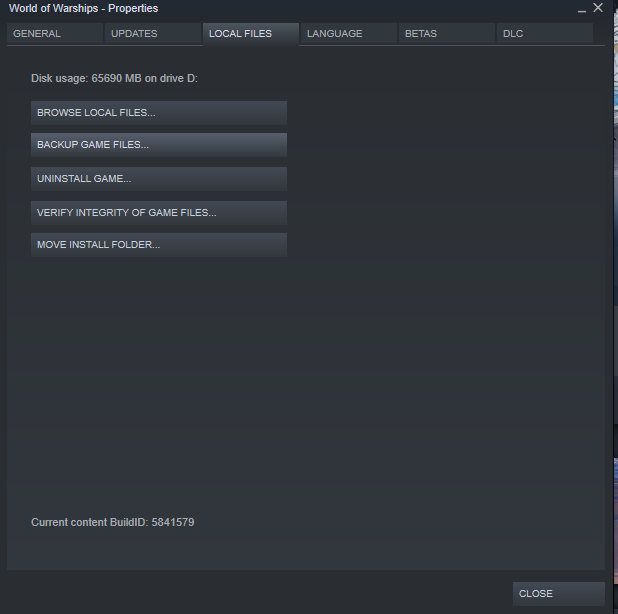

Installing the mod is fairly straightforward. Go to the [Releases](https://github.com/landaire/O7/releases/) page in this GitHub repository, download the "Binaries" for the latest release, and extract to the `res_mods\banks\mods` directory for the current version of the game.

To find the current version, go into your `World of Warships\bin` directory. There should be a bunch of folders with numbers here. Sort the files by descending file names (large numbers on top) and go into the top directory. This should be the latest version of the game.

At the time of writing this looks something like `World of Warships\bin\3052606`. If you have no mods installed you'll probably have to create the following subdirectories: `res_mods\banks\mods`. The full path you're extracting the zip to should look like `World of Warships\bin\3052606\res_mods\banks\mods`. Once extracted the `mods` directory should have an `O7` directory with a bunch of audio files in it.

The current version of the game is represented by the `3052606` in the above path. If an update is pushed out for the game you will need to move the mod

## Finding the WoWs install directory

If you aren't sure where World of Warships is installed, right-click the game in Steam and go to `Properties`. Click on `Local Files`, then `Browse Local Files`:

Windows Explorer should pop up in your Steam `World of Warships` installation directory.